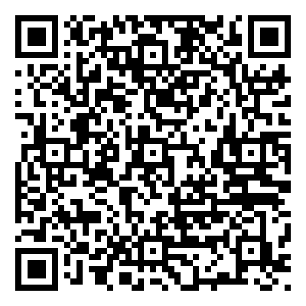
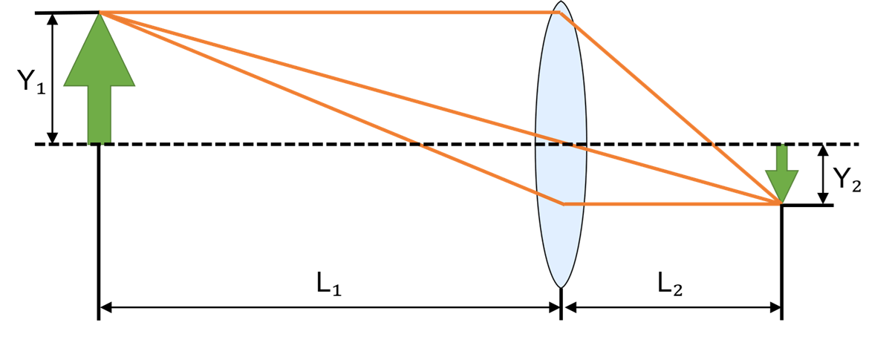
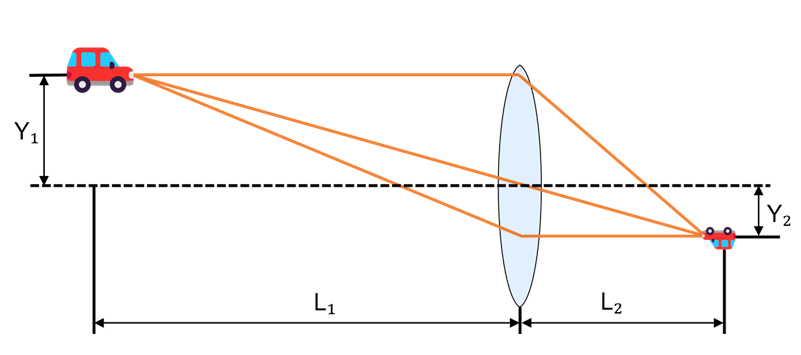
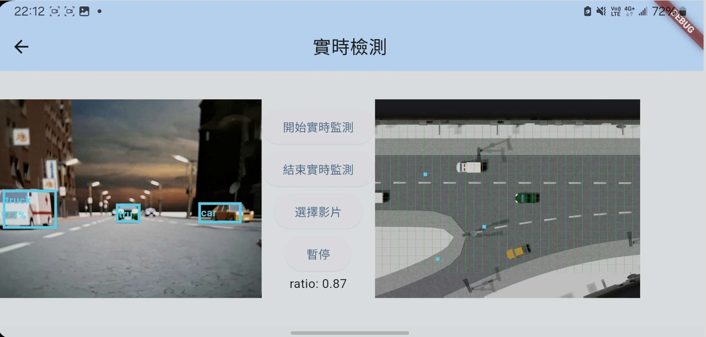
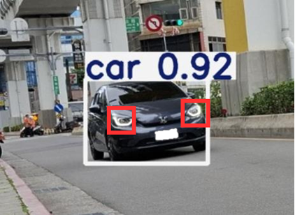

# R.I.D.E. (Real-time Identification for Driving Environment)
R.I.D.E., which stands for Realtime Identification for Driving Environment, is a senior project developed in the Department of Computer Science and Information Engineering at National Central University.

## Team Members & Advisor
Team Members: Yu-Hsiang Hsu (許煜祥), Cheng-Ru Chuang (莊承儒)

Advisor: Prof. Hung-Hsuan Chen (陳弘軒)

## Features
- Real-time vehicle detection using smartphone cameras
- Spatial audio warnings to alert drivers of approaching vehicles
- Distance and position estimation based on YOLO and geometric calculations

## Installation

1. Ensure that **Flutter** is properly installed on your machine.  
   You can follow the official guide: [Flutter Installation Guide](https://flutter.dev/docs/get-started/install)

2. Open a new Flutter project using **Visual Studio Code**.

3. Run the following command to verify your environment:
   ```
   flutter doctor
   ```
    Make sure all checkmarks are green.
4. Delete all existing files inside the `lib/` folder, then copy all files from this folder

5. Choose a device to run the app:
    - Use an Android emulator from Android Studio, or
    - Connect a physical Android device via USB.

6. Run the Flutter project:
    ```
    flutter run
    ```

## Usage
See our [demostration video](https://www.youtube.com/watch?v=nuTp5R2rRJ4&t=2s) on Youtube.

### More Info
Scan QRcode to see our slide on this project.



## Introduction
Road safety has long been a critical issue in Taiwan. In the first nine months of 2024 alone, motorcycle accidents resulted in over 300,000 casualties, including 1,375 fatalities. Motivated by a desire to contribute to improving traffic safety through our technical expertise, we have developed a mobile application aimed at enhancing rider awareness and situational awareness on the road.

Our application leverages the ubiquitous smartphone camera to perform real-time image recognition. It is capable of detecting approaching vehicles from the rear and estimating their relative position. Upon identifying a potential threat, the system emits a spatialized warning sound to alert the rider, effectively providing an additional layer of perception and improving their ability to respond promptly to surrounding traffic conditions.

### Methods
As the graph shown below, there is a formula：
$\frac{Y_1}{Y_2} = \frac{L_1}{L_2}$

#### Vertical Distance

$Y_1$: Actual width of the vehicle front (known)

$Y_2$: Detected width of the vehicle front from YOLO (known)

$L_1$: Distance to the approaching vehicle (unknown)

$L_2$: Imaging distance (unknown)

In this project, we use the actual width of the vehicle front (Y1), which remains relatively consistent across different types of vehicles.

By assuming $L_1 = \frac{Y_1L_2}{Y_2}$, the distance to the approaching vehicle ($L_1$) can be calculated.

$L_2$ is an unknown variable that varies depending on the camera used.
Therefore, before performing detection, it is necessary to calibrate the system using a reference image in which the vehicle is at a known distance $L_1$.

#### Horozontal Distance


$Y_1$: Horizontal position relative to the camera (unknown)

$Y_2$: Horizontal distance between the detected object and the center of the image (known)

$L_1$: Estimated distance to the approaching vehicle (known)

$L_2$: Imaging distance obtained during calibration (known)

Using these values, the horizontal position $Y_1=\frac{Y_2L_1}{L_2}$ can be calculated.

By combining both the distance and horizontal position, the system can determine the relative position of the approaching vehicle with respect to the user. Based on this relative position, a spatialized warning sound is played using a Flutter audio package (`flutter_soloud`) to alert the user to the direction of the oncoming vehicle.

### Results

This image shows the actual detection interface of the app.

The detected object is part of a virtual scene, and its estimated position is marked on the top-down view on the right.

### Future Works
#### Model Refinement


The detection results are limited by the accuracy of the model.

In the current version of the app, real-time detection may occasionally fail to identify vehicles or produce false positives due to insufficient distance resolution or detection confidence.

From a safety perspective, such issues could pose potential risks.

##### Proposed Improvement:
Fine-tune the YOLO model to enhance its ability to recognize vehicles more reliably.

#### Precise Width Estimation


In addition to detecting the front of the vehicle, YOLO often includes parts of the vehicle body within its bounding box.

Moreover, the appearance of the vehicle front can be distorted due to the viewing angle.

Consequently, the width of the bounding box does not perfectly correspond to the actual vehicle width, resulting in minor errors in distance estimation.

##### Proposed Improvement:
Train the YOLO model to specifically detect vehicle headlights.

By calculating the actual width based on the relative positions of the two headlights, a more accurate estimation of vehicle width can be achieved.
